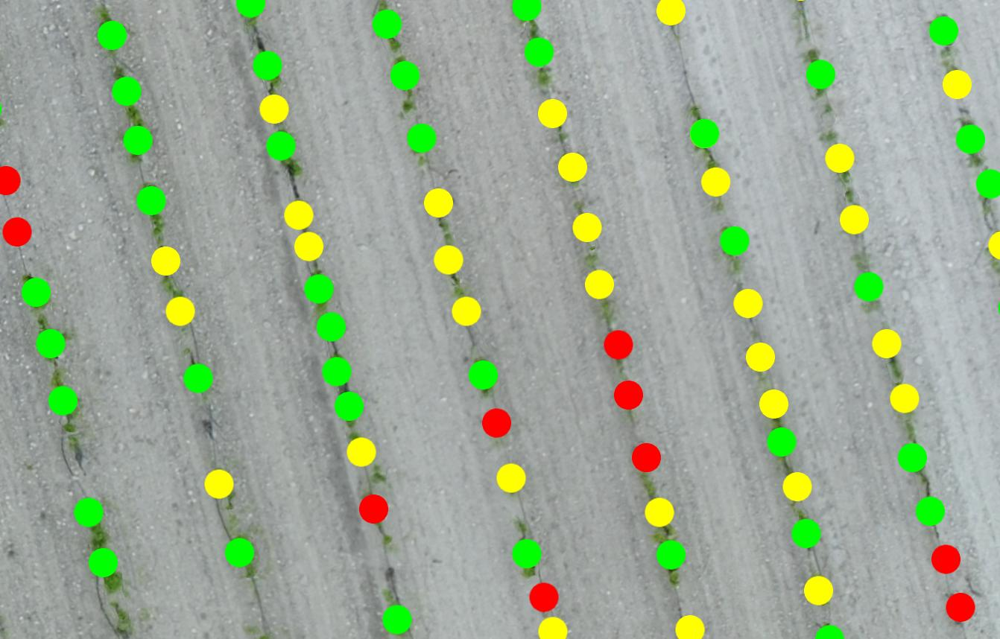

# Dot Counter

## Description

This program counts colored dots in inputted images.

## Examples

To count the dots in the `images/dot.jpg` file, run the following command:



```sh
python dotcounter.py images/dot.jpg
# No. of red      circles detected = 10
# No. of green    circles detected = 39
# No. of yellow   circles detected = 31
```

You can also open a GUI to view which dots are classified under each color.

```sh
python dotcounter.py images/dot.jpg --show
# No. of red      circles detected = 10
# No. of green    circles detected = 39
# No. of yellow   circles detected = 31
# ... also opens up a window...
```

## Dependencies

To use `dotcounter.py` you will need to have installed...
numpy, scipy, opencv-python, matplotlib

